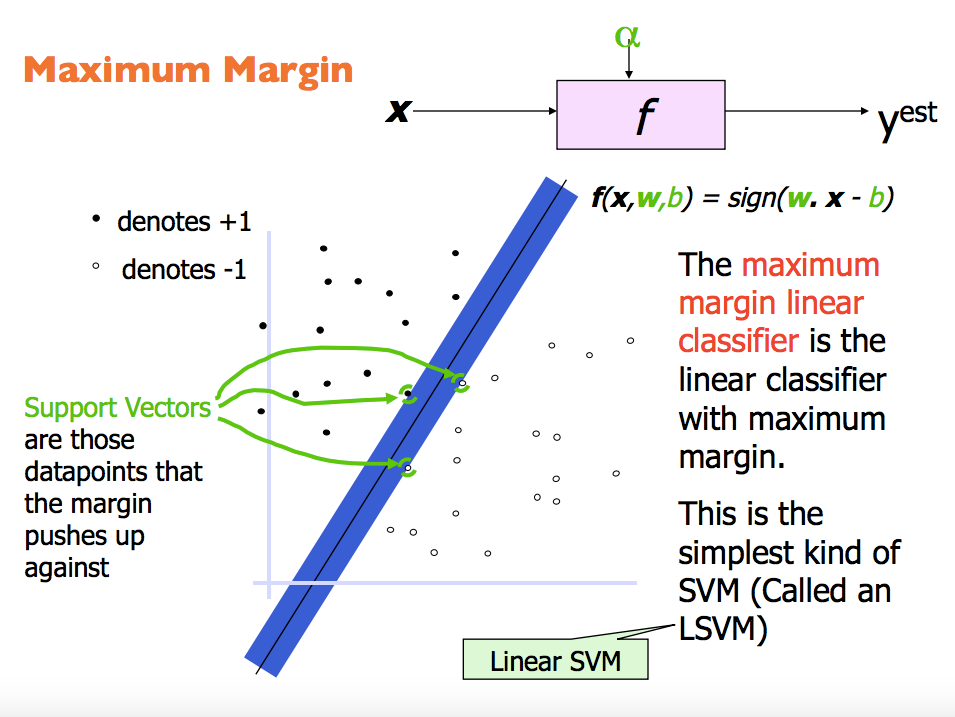
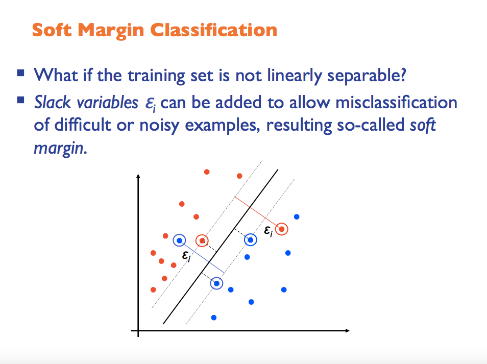

## SVM

------

## 基本概念

* 一种监督式学习的方法
* 支持向量机构造一个超平面或者多个超平面，这些超平面可能是高维的，甚至可能是无限多维的。在分类任务中，它的原理是，将决策面（超平面）放置在这样的一个位置，两类中接近这个位置的点距离的都最远。

##核心思想
* Use kernel function to transform low dimensional training samples to higher dim (for linear separability problem)
* Use quadratic programming (QP) to find the best classifier boundary hyperplane (for global optima) 

## 分类
* 线性可分支持向量机
* 线性支持向量机
* 非线性支持向量机
  

## 线性可分支持向量机

## 线性支持向量机

###例图

###Hinge loss

------
# 参考资料

 * [龙星计划课程lecture 4-5](http://bigeye.au.tsinghua.edu.cn/DragonStar2012/introduction.html)
 
 * [July](http://blog.csdn.net/v_july_v/article/details/7624837)
 	
 * [Wiki](http://zh.wikipedia.org/wiki/%E6%94%AF%E6%8C%81%E5%90%91%E9%87%8F%E6%9C%BA)
 
 * [libsvm代码注释](http://www.pami.sjtu.edu.cn/people/gpliu/document/libsvm_src.pdf)
 
 

